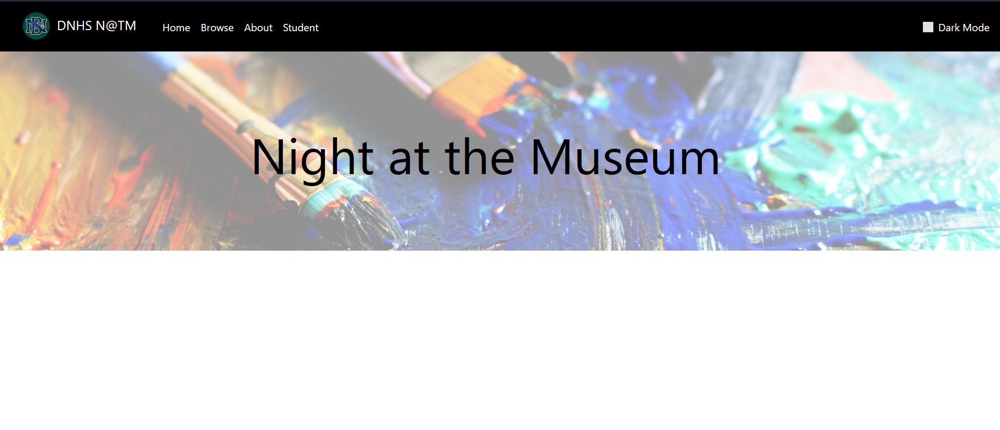
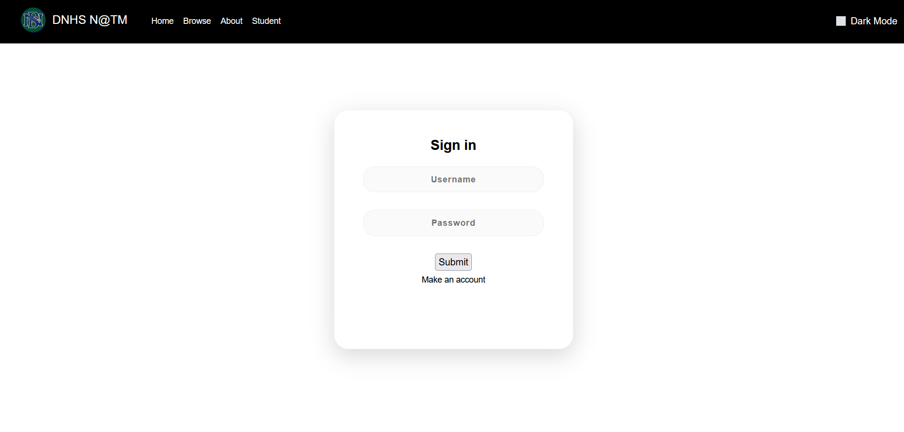
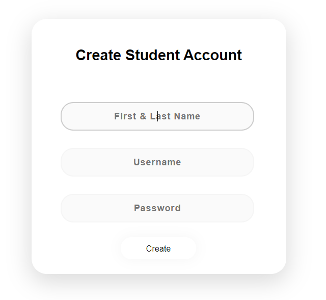
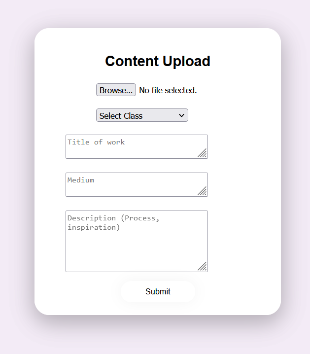
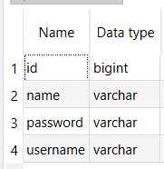
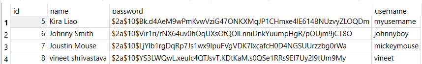

## Client Project

### Purpose
- Make a virtual version of NATM so that it is easily accessible online
- Make an easy way to upload photos of art so not much manual labor needs to be done
- Using login and session with role management & security
- Create a way to sift through the photos of art by name or class easily

### Front end development
Since I was assigned the role of front-end developer, I worked on many HTML features. 
- Using bootstrap to support

#### Main page and navbar
- Navbar includes dark mode feature


#### Login page


#### New account page


#### Submission upload page


Pages that require submission from user user POST and forms to capture information.

### Back end development
I worked on the login and account creation system. The tables have four columns: a generated ID, Full name, username, and password. 
Students can create an account and log in using their username and password.




Student.java
```
@Data
@NoArgsConstructor
@AllArgsConstructor
@Entity
public class Student {
    // automatic unique identifier for Person record
    @Id
    @GeneratedValue(strategy = GenerationType.AUTO)
    private Long id;

    // email, password, roles are key to login and authentication
    @NotEmpty
    @Size(min=5)
    @Column(unique=true)
    @NotEmpty
    private String username;

    @NotEmpty
    private String password;

    @ManyToMany(fetch = EAGER)
    private Collection<Role> roles = new ArrayList<>();

    // @NonNull: Places this in @RequiredArgsConstructor
    @NonNull
    @Size(min = 2, max = 30, message = "Name (2 to 30 chars)")
    private String name;


    // Initializer used when setting database from an API
    public Student(String username, String password, String name, Role role) {
        this.username = username;
        this.password = password;
        this.name = name;
        this.roles.add(role);
    }

}
```

StudentViewController.java
```
@Controller
public class StudentViewController {
    // Autowired enables Control to connect HTML and POJO Object to database easily for CRUD
    @Autowired
    private ModelRepository repository;

    @GetMapping("/sql/student")
    public String student(Model model) {
        List<Student> list = repository.listAll();
        model.addAttribute("list", list);
        return "sql/student";
    }

    /*  The HTML template Forms and PersonForm attributes are bound
        @return - template for person form
        @param - Person Class
    */
    @GetMapping("sql/studentcreate")
    public String studentAdd(Student person) {
        return "sql/studentcreate";
    }

    /* Gathers the attributes filled out in the form, tests for and retrieves validation error
    @param - Person object with @Valid
    @param - BindingResult object
     */
    @PostMapping("sql/studentcreate")
    public String personSave(@Valid Student student, BindingResult bindingResult) {
        // Validation of Decorated PersonForm attributes
        if (bindingResult.hasErrors()) {
            return "sql/studentcreate";
        }
        repository.save(student);
        repository.addRoleToPerson(student.getUsername(), "ROLE_STUDENT");
        // Redirect to next step
        return "redirect:/sql/studentcreate";
    }

    @GetMapping("/sql/studentupdate/{id}")
    public String personUpdate(@PathVariable("id") int id, Model model) {
        model.addAttribute("person", repository.get(id));
        return "sql/studentupdate";
    }

    @PostMapping("/sql/studentupdate")
    public String personUpdateSave(@Valid Student student, BindingResult bindingResult) {
        // Validation of Decorated PersonForm attributes
        if (bindingResult.hasErrors()) {
            return "sql/studentupdate";
        }
        repository.save(student);
        repository.addRoleToPerson(student.getUsername(), "ROLE_STUDENT");

        // Redirect to next step
        return "redirect:/sql/studentcreate";
    }

    @GetMapping("/sql/studentdelete/{id}")
    public String personDelete(@PathVariable("id") long id) {
        repository.delete(id);
        return "redirect:/sql/student";
    }

    @GetMapping("/sql/student/search")
    public String student() {
        return "sql/student_search";
    }

}
```

If students enter the correct login and username, they are redirected to the main page. Otherwise, the login form shows an error.

Students are automatically given a "Student" role upon creating an account. According to security, they can only access the upload page if they are a student or teacher.
Only accounts with the teacher role can delete uploads.

SecurityConfig.java
```
.authorizeRequests()
.antMatchers(POST, "/api/student/post/**").hasAnyAuthority("ROLE_STUDENT")
.antMatchers(DELETE, "/api/student/delete/**").hasAnyAuthority("ROLE_ADMIN")
.antMatchers("/sql/studentupdate/**").hasAnyAuthority("ROLE_STUDENT")
.antMatchers("/sql/studentdelete/**").hasAnyAuthority("ROLE_ADMIN")
.antMatchers( "/api/student/**").permitAll()
.antMatchers( "/api/refresh/token/**").permitAll()
.antMatchers("/", "/starters/**", "/frontend/**", "/mvc/**", "/database/person/**", "/sql/studentcreate", "/course/**").permitAll()
.anyRequest().authenticated()
.and()
.formLogin()
.loginPage("/login")
.permitAll()
.and()
.logout()
.logoutRequestMatcher(new AntPathRequestMatcher("/logout"))
.logoutSuccessUrl("/sql/student")
.permitAll()
```