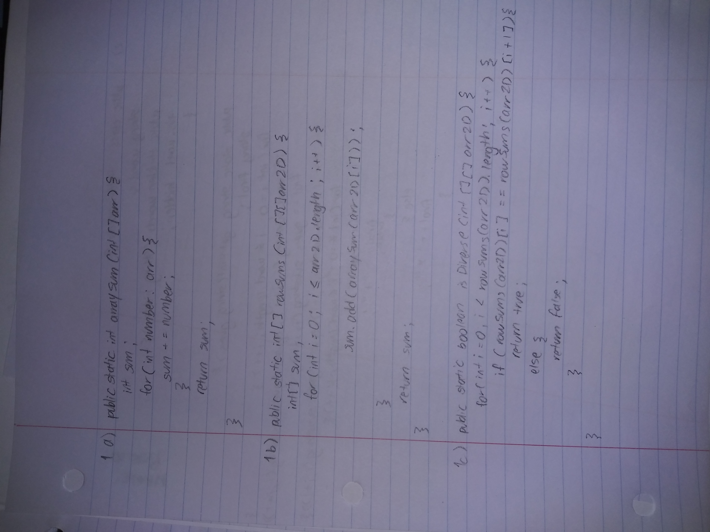
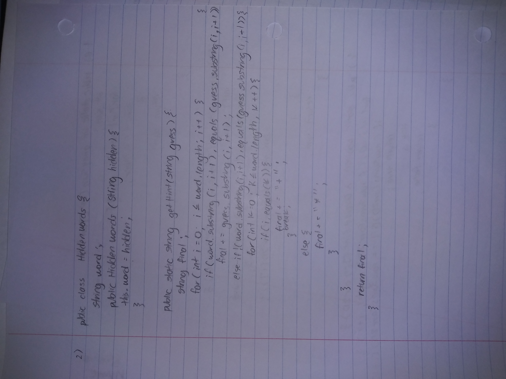
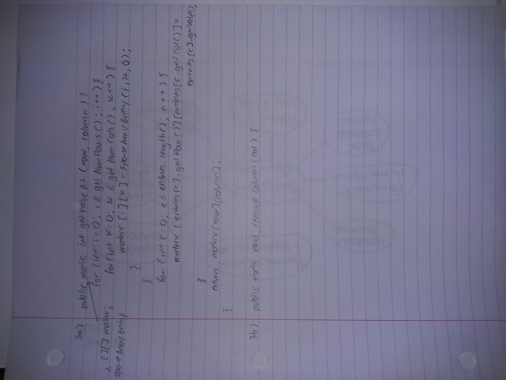

## 2015 MC Review

### Question Corrections
#### Q2

A 15-line code segment reads as follows.

What is printed as a result of executing the code segment?
```
First loop: 
r = 3
Inner forloop 1: 
c = 1, r = 3 : -
c = 2, r = 3 : --
Inner forloop 2:
c = 3: --*

Second loop:
r = 2
Inner forloop 1:
c = 1, r = 2 : -
Inner forloop 2:
c = 2 : -*
c = 3 : -**

Third loop:
r = 1
Inner forloop 2:
c = 1 : *
c = 2 : **
c = 3 : ***
```
Answer : 

#### Q4

Consider the following instance variable and method.


Method findMax is intended to return the largest value in the array arr. Which of the following best describes the conditions under which the method findMax will not work as intended?

```
for (int val : arr){
// insert code here
}

For loop only traverses positive values of array. 
```
Answer: The largest value in arr is negative. 

#### Q5
Assume that x and y are boolean variables and have been properly initialized.


Which of the following always evaluates to the same value as the expression above?

```
(x || y) && x
x && x OR x && y
x && x = x
```
Answer: X

#### Q6
Consider the following method, which is intended to return true if at least one of the three strings s1, s2, or s3 contains the substring "art". Otherwise, the method should return false.


Which of the following method calls demonstrates that the method does not work as intended?

Answer: A

#### Q11
Consider the following method.


Which of the following calls to mystery will return true?

```
for (int k = str.length(); k > 0; k--)
{
    temp = temp + str.substring(k - 1, k);
}
return temp.equals(str);

k = str.length() = 4
For loop:
temp = str.substring(3, 4); = "n"
temp = str.substring(2, 3); = "o"
temp = str.substring(1, 2); = "o"
temp = str.substring(0, 1); = "n"

```

Answer: noon

#### Q12
Assume that x and y are boolean variables and have been properly initialized.


Which of the following best describes the result of evaluating the expression above?
```
(x && y) && !(x || y)
(x && y) && (!x && !y)
Never evaluates to true
```

Answer: False always

### 2015 FRQ





Runtime at week 6:
[Link to repl](https://replit.com/@4DISEASE/csa)

#### FRQ 1 Code
```java
import java.io.*;
import java.util.*;

public class Arrays
{

  public static int arraySum(int[] arr){
    int sum = 0;
    
    for(int number : arr){
      sum += number;
    }
    return sum;
  }

  public static int[] rowSums(int[][] arr2D){
    // mistake: int[] sum
    int[] sum = new int[arr2D.length];
    //   mistake: for (int i = 0; i <= arr2D.length; i++){
    //   sum[i] = arraySum(arr2D[i]);
    // }
    int index = 0;
    for (int num : sum){
      sum[index] = arraySum(arr2D[index]);
      index++;
    }
    return sum;
  }

  public static boolean isDiverse(int[][] arr2D){
      // 
    for(int i = 0; i < rowSums(arr2D).length - 1; i++){
      if(rowSums(arr2D)[i] == rowSums(arr2D)[i + 1]){
        return false;
      }
    }
    return true;
  }

  public static void main(String[] args) {
    int array[][] = {{1, 3, 2, 7, 3},
                     {10, 10, 4, 2, 6},
                     {5, 3, 5, 9, 6},
                     {7, 6, 4, 2, 1}};

    System.out.println("arraySum method: " + arraySum(array[1]));
    System.out.println("rowSums method: ");

    for (int number : rowSums(array)){
      System.out.print(number + ", ");
    }

    System.out.println("isDiverse method: " + isDiverse(array));
}
  }      
```

#### FRQ 2 Code
```java
import java.io.*;
import java.util.*;

public class HiddenWords
{
  String word;
  
  public HiddenWords(String hidden){
    this.word = hidden;
  }

  public String getWord(){
    return this.word;
  }

public String getHint(String guess){
  //String final;
  String finalword = "";
  
  for(int i = 0; i < word.length(); i++){
    //word.length
    if(word.substring(i, i + 1).equals(guess.substring(i, i + 1))){
        //finalword += guess.substring(i + 1);
      finalword += guess.substring(i, i + 1);
    }

 // else if (!(word.substring(i, i + 1).equals(guess.substring(i, i + 1)))){
//   for(int k = 0; k <= word.length(); k++){
//     if(word.substring(i, i + 1).equals(guess.substring(k, k + 1))){
//       finalword += "+";
//     } 
      
    else if (word.indexOf(guess.substring(i,i+1))!= -1){
        finalword += "+";
    }
        else{
          finalword += "*";
        }
      }
      return finalword;
    }

  public static void main(String[] args) {
    boolean gamecomplete = false;
    HiddenWords harps = new HiddenWords("HARPS");

    Scanner myObj = new Scanner(System.in);
    System.out.println("Enter 5-letter guess");

    while(!gamecomplete){
    String userGuess = myObj.nextLine();
      if(harps.getHint(userGuess).equals(harps.getWord())){
        System.out.println("You win!");
        gamecomplete = true;
      }
    System.out.println(harps.getHint(userGuess));
    }
}
  }      
```

#### FRQ 3 Code
```java
import java.io.*;
import java.util.*;
import java.util.ArrayList;

public class SparseArrayEntry{
  private int row;
  private int col;

  private int value;

  public SparseArrayEntry(int r, int c, int v){
    row = r;
    col = c;
    value = v;
  }

  public int getRow(){
    return row;
  }

  public int getCol(){
    return col;
  }

  public int getValue(){
    return value;
  }
}

class SparseArray{
  private int numRows;
  private int numCols;

  private List<SparseArrayEntry> entries;

  public SparseArray(){
    entries = new ArrayList<SparseArrayEntry>();
  }

  public void setSize(){
      int temp = entries.get(0).getRow();
  for(int i = 0; i < entries.size(); i++){
    if(entries.get(i).getRow() > temp){
      temp = entries.get(i).getRow();
    }
  this.numRows = temp;  
  }

    int temp2 = entries.get(0).getCol();
  for(int i = 0; i < entries.size(); i++){
    if(entries.get(i).getCol() > temp2){
      temp = entries.get(i).getCol();
    }
  this.numCols = temp2;  
  }
  }

  public List<SparseArrayEntry> getEntries(){
    return this.entries;
  }

  public void addEntry(SparseArrayEntry entry){
    this.entries.add(entry);
  }

  public int getNumRows(){
    return numRows;
  }

  public int getNumCols(){
    return numCols;
  }

  public int getValueAt(int row, int col){
    for(SparseArrayEntry e : entries){
      if(e.getRow() == row && e.getCol() == col){
        return e.getValue();
      }
    }
    return 0;
  }

  public void removeColumn(int col){
    int i=0;
    while (i < entries.size()){
      SparseArrayEntry e = entries.get(i);
      if (e.getCol() > col){
        entries.set(i, new SparseArrayEntry(e.getRow(), e.getCol()-1, e.getValue()));
        i++;
      }
      else{
        i++;
      }
    }
    numCols--;
  }

  public void printArray(){
    for(int i = 0; i <= this.getNumRows(); i++){
      for(int k = 0; k <= this.getNumCols(); k++){
        System.out.print(getValueAt(i, k) + " ");
      }
     System.out.print("\n");
    }
  }

  public static void main(String[] args){
    SparseArrayEntry one = new SparseArrayEntry(1, 4, 4);
      SparseArrayEntry two = new SparseArrayEntry(2, 0, 1);
    SparseArrayEntry three = new SparseArrayEntry(3, 1, -9);
    SparseArrayEntry four = new SparseArrayEntry(1, 1, 5);

    SparseArray sparseArray = new SparseArray();

    sparseArray.addEntry(one);
    sparseArray.addEntry(two);
    sparseArray.addEntry(three);
    sparseArray.addEntry(four);

    sparseArray.setSize();

    System.out.println("Print Sparse Array");
    sparseArray.printArray();
    
    System.out.println("Get value at position (1, 4)");
    System.out.println(sparseArray.getValueAt(1, 4));

    System.out.println("Remove column 2");
    sparseArray.removeColumn(2);
    sparseArray.printArray();
    }
  }
```

#### FRQ 4
```java
import java.util.*;

//not attempted

public interface NumberGroup {
  boolean contains(int num);
}

class Range implements NumberGroup {
  private int min;
  private int max;

  public Range(int min, int max) {
    this.min = min;
    this.max = max;
  }

  public boolean contains (int num) {
    return num >= min && num <= max;
  }

}

class MultipleGroups {
  private List<NumberGroup> groupList;

  public MultipleGroups(List<NumberGroup> gr){
    groupList = gr;
  }
  
  public boolean contains(int num) {
    for (NumberGroup group : groupList) {
      if (group.contains(num)) {
        return true;
      }
    }
    return false;
  }

  public static void main(String[] args) {
    Range one = new Range(1, 7);
    Range two = new Range(2, 9);
    Range three = new Range(3, 10);

    System.out.println("Range 1: 1, 7");
    System.out.println("Range 2: 2, 9");
    System.out.println("Range 3: 3, 10");
    System.out.println("Range Contains method");
    System.out.println("Range 1 Contains 11?: " + one.contains(11));
    System.out.println("Range 2 Contains 4?: " + two.contains(4));

    List<NumberGroup> list = new ArrayList<NumberGroup>();
    list.add(one);
    list.add(two);
    list.add(three);

    System.out.println("Multiple Groups with range 1, 2, 3:");
    MultipleGroups group = new MultipleGroups(list);
     System.out.println("Does range contain 3?: " + group.contains(3));

    
  }
}
```


