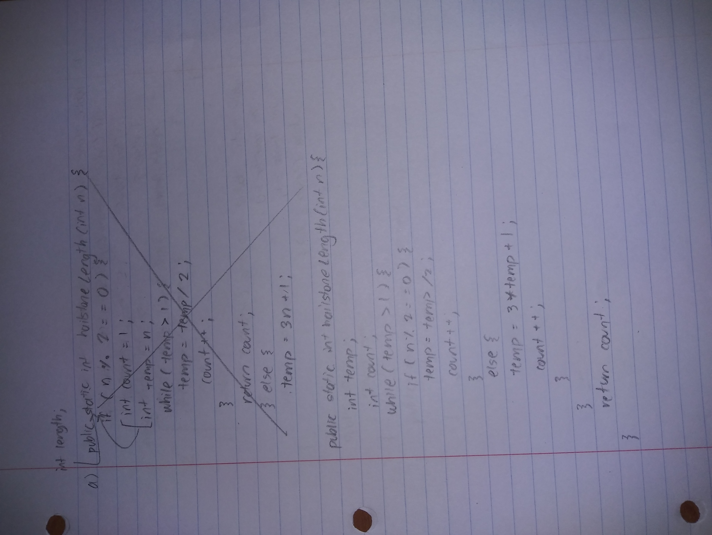
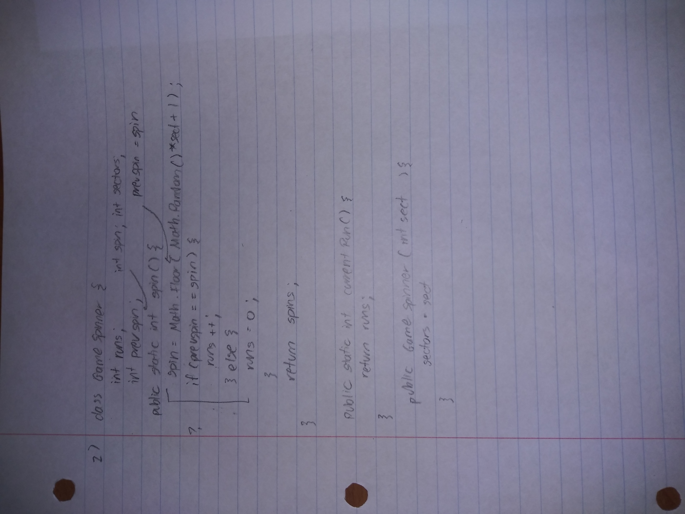

## 2020 MC

#### Q3
Consider the method getHours, which is intended to calculate the number of hours that a vehicle takes to travel between two mile markers on a highway if the vehicle travels at a constant speed of 60 miles per hour. A mile marker is a sign showing the number of miles along a road between some fixed location (for example, the beginning of a highway) and the current location.

The following table shows two examples of the intended behavior of getHours, based on the int parameters marker1 and marker2.

Consider the following implementation of getHours.
```
public static double getHours(int marker1, int marker2)

{

/* missing statement */

return hours;

}
```
Which of the following statements can replace /* missing statement */ so getHours works as intended?

Answer: double hours = Math.abs(marker1 - marker2) / 60.0;

#### Q6
Which of the following expressions evaluate to 3.5 ?

    (double) 2 / 4 + 3
    (double) (2 / 4) + 3
    (double) (2 / 4 + 3)

Answer: I only

#### Q8
Consider the following class definition.

```
public class Points
{
private double num1;
private double num2;

public Points(int n1, int n2)            // Line 6
{
num1 = n1;                            // Line 8
num2 = n2;                            // Line 9
}

public void incrementPoints(int value)   // Line 12
{
n1 += value;                          // Line 14
n2 += value;                          // Line 15
}
}
```
The class does not compile. Which of the following identifies the error in the class definition?

Answer: In lines 14 and 15, the variables n1 and n2 are not defined.

#### Q11
Which of the following code segments produces the output "987654321" ?

Answer: 
```
int num = 10;

while (num > 1)

{

num--;

System.out.print(num);

}
```

#### Q14
The following categories are used by some researchers to categorize zip codes as urban, suburban, or rural based on population density.

    An urban zip code is a zip code with more than 3,000 people per square mile.
    A suburban zip code is a zip code with between 1,000 and 3,000 people, inclusive, per square mile.
    A rural zip code is a zip code with fewer than 1,000 people per square mile.

Consider the following method, which is intended to categorize a zip code as urban, suburban, or rural based on the population density of the area included in the zip code.

```
public static String getCategory(int density)
{
/* missing code */
}
```
Which of the following code segments can replace /* missing code */ so the getCategory method works as intended?

```

    String cat; if (density > 3000) { cat = "urban"; } else if (density > 999) { cat = "suburban"; } else { cat = "rural"; } return cat;
    String cat; if (density > 3000) { cat = "urban"; } if (density > 999)  { cat = "suburban"; } cat = "rural";  return cat;
    if (density > 3000) {    return "urban"; } if (density > 999)  {    return "suburban"; } return "rural"; 
```

Answer: I and III Only
## 2020 FRQ





Runtime at week 7:
[Link to repl](https://replit.com/@4DISEASE/csa)

### FRQ 1 Code
```
class Hailstone{
  int length;
  public Hailstone(int firstNum){
    length = hailstoneLength(firstNum);
  }

  public int getLength(){
    return this.length;
  }
  
  public static int hailstoneLength(int n){
    //int temp;
    int temp = n;
    int count = 1;
    while(temp > 1){
      //if (n % 2 ==0)
      if(temp % 2 == 0){
        temp = temp/2;
        count++;
      }
      else{
        temp = 3*temp+1;
        count++;
      }
    }
    return count;
  }

  public static boolean isLongSeq(int n){
    if(n < hailstoneLength(n)){
      return true;
    }
    else{
      return false;
    }
  }

  public static double propLong(int n){
    int counter = 0;
    int i = 1;
      while(i <= n){
        if(isLongSeq(i)){
          counter++;
        }
        i++;
      }
    return (double)counter/(double)n;
  }

  public static void main(String[] args){
    Hailstone one = new Hailstone(5);
    Hailstone two = new Hailstone(8);

    System.out.println("Length of hailstone starting with 5: " + one.getLength());
    System.out.println("Length of hailstone starting with 8: " + two.getLength());

    System.out.println("isLongSeq method 5: " + one.isLongSeq(5));
    System.out.println("isLongSeq method 8: " + two.isLongSeq(8));

    System.out.println("propLong method 10: " + one.propLong(10));
  }
}
```

### FRQ 2 Code
```
import java.util.*;

class GameSpinner{
  private static int runs;
  private static int prevspin;
  private static int spinval;
  private static int sectors;

  public GameSpinner(int sect){
    sectors = sect;
  }
  
  public static int spin(){
    prevspin = spinval;
    //Math.floor(Math.random()*sectors)
    spinval = (int)(Math.random()*sectors + 1);
    if(prevspin == spinval){
      runs++;
    }
    else{
      runs = 0;
    }
    return spinval;
  }

  public static int currentRun(){
    return runs;
  }

  public static void main(String[] args){

    System.out.println("Gamespinner created with 4 sectors");
    GameSpinner game = new GameSpinner(4);

    
    System.out.println("Spin: " + game.spin());
    System.out.println("Current runs: " + game.currentRun());
    System.out.println("Spin: " + game.spin());
    System.out.println("Current runs: " + game.currentRun());
    System.out.println("Spin: " + game.spin());
    System.out.println("Current runs: " + game.currentRun());
    System.out.println("Spin: " + game.spin());
    System.out.println("Current runs: " + game.currentRun());
  }
}
```

### FRQ 3 Code
```
import java.util.*;

class ProductReview
{
    private String name;
    private String review;

    /** Constructs a ProductReview object and initializes the instance variables. */
    public ProductReview(String pName, String pReview)
    {
        name = pName;
        review = pReview;
    }

    /** Returns the name of the product. */
    public String getName()
    {
        return name;
    }

    /** Returns the review of the product. */
    public String getReview()
    {
        return review;
    }
}

class ReviewCollector
{
    private ArrayList<ProductReview> reviewList;
    private ArrayList<String> productList;

    /** Constructs a ReviewCollector object and initializes the instance variables. */
    public ReviewCollector()
    {
        reviewList = new ArrayList<ProductReview>();
        productList = new ArrayList<String>();
    }

    /** Adds a new review to the collection of reviews, as described in Part (a). */
    public void addReview(ProductReview prodReview)
    {
        reviewList.add(prodReview);
        productList.add(prodReview.getName());
    }

    /** Returns the number of good reviews for a given product name, as described in Part (b). */
    public int getNumGoodReviews(String prodName)
    {
      int good = 0;
        for(ProductReview review: reviewList){
          if(review.getName().contains(prodName)){
            if(review.getReview().contains("best")){
              good++;
            }
          }
        }
      return good;
    }

  public void printLists(){
    System.out.print("\n");
    System.out.println("Review list");
    for(ProductReview review : reviewList){
      System.out.println(review.getName()+": "+ review.getReview());
    }
    System.out.print("\n");
     System.out.println("Product list");
    for(String product : productList){
      System.out.println(product);
    }
  }

    // There may be instance variables, constructors, and methods not shown.
  public static void main(String[] args){
    ProductReview apple = new ProductReview("Apple", "best ever TBH");
    ProductReview apple2 = new ProductReview("Apple", "i hate apples so bad");
    ProductReview apple3 = new ProductReview("Apple", "my best friend likes apples");
    ProductReview banana = new ProductReview("Banana", "Also not very good");
    ProductReview nectarine = new ProductReview("Nectarine", "Kinda good");
    ReviewCollector reviews = new ReviewCollector();

    reviews.addReview(apple);
    reviews.addReview(apple2);
    reviews.addReview(apple3);
    reviews.addReview(banana);
    reviews.addReview(nectarine);
    reviews.printLists();

    System.out.print("\n");
    System.out.println("Good review search for Apple: " + reviews.getNumGoodReviews("Apple"));
    
  }
}
```

### FRQ 4 Code
```
class Seat
{
private boolean available;
private int tier;
public Seat(boolean isAvail, int tierNum)
{
available = isAvail;
tier = tierNum;
}

public boolean isAvailable()
{  return available;  }

public int getTier()

{  return tier;  }

public void setAvailability(boolean isAvail)

{  available = isAvail;  }

}


class Theater{

private Seat[][] theaterSeats;

/** Constructs a Theater object, as described in part (a).

* Precondition: seatsPerRow > 0; tier1Rows > 0; tier2Rows >= 0

*/

public Theater(int seatsPerRow, int tier1Rows, int tier2Rows)
{
  theaterSeats= new Seat[tier1Rows+tier2Rows][seatsPerRow];
}

/** Returns true if a seat holder was reassigned from the seat at fromRow, fromCol

* to the seat at toRow, toCol; otherwise it returns false, as described in part (b).

* Precondition: fromRow, fromCol, toRow, and toCol represent valid row and

* column positions in the theater.

* The seat at fromRow, fromCol is not available.

*/

public boolean reassignSeat(int fromRow, int fromCol, int toRow, int toCol) {

if(theaterSeats[toRow][toCol].isAvailable()) {
int tierDestination =theaterSeats[toRow][toCol].getTier();
int tierSource =theaterSeats[fromRow][fromCol].getTier();
  if(tierDestination<=tierSource) {
    if(tierDestination==tierSource) {
      if(fromRow<toRow) {
        return false;
        }else {
        theaterSeats[toRow][toCol].setAvailability(false);
        theaterSeats[fromRow][fromCol].setAvailability(true);
        return true;
        }
      }
    theaterSeats[toRow][toCol].setAvailability(false);
    theaterSeats[fromRow][fromCol].setAvailability(true);
    return true;
    }else {
    return false;
    }
  }else {
  return false;
}

}

  public static void main(String[] args){
     Theater t1 = new Theater(3,1,2);
    
t1.theaterSeats[0][0] = new Seat(true,1);

t1.theaterSeats[0][1] = new Seat(false,1);

t1.theaterSeats[0][2] = new Seat(true,1);

t1.theaterSeats[1][0] = new Seat(true,2);

t1.theaterSeats[1][1] = new Seat(true,2);

t1.theaterSeats[1][2] = new Seat(true,2);

t1.theaterSeats[2][0] = new Seat(false,2);

t1.theaterSeats[2][1] = new Seat(false,2);

t1.theaterSeats[2][2] = new Seat(true,2);

System.out.println("Theater:");

for(int i=0;i<3;i++) {

for(int j=0;j<3;j++) {

System.out.print("["+i+"]"+"["+j+"] : "+t1.theaterSeats[i][j].isAvailable()+" ");

}

System.out.println();

}

System.out.println("(2,1) want to change seat to (0,0)");

System.out.println("["+2+"]"+"["+1+"]"+" to "+"["+0+"]"+"["+0+"]");

t1.reassignSeat(2, 1, 0, 0);

for(int i=0;i<3;i++) {

for(int j=0;j<3;j++) {

System.out.print("["+i+"]"+"["+j+"] : "+t1.theaterSeats[i][j].isAvailable()+" ");

}

System.out.println();

}
  }

}

```